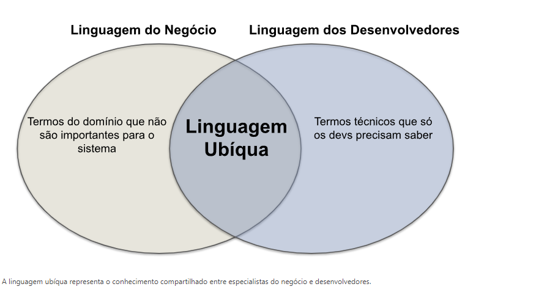
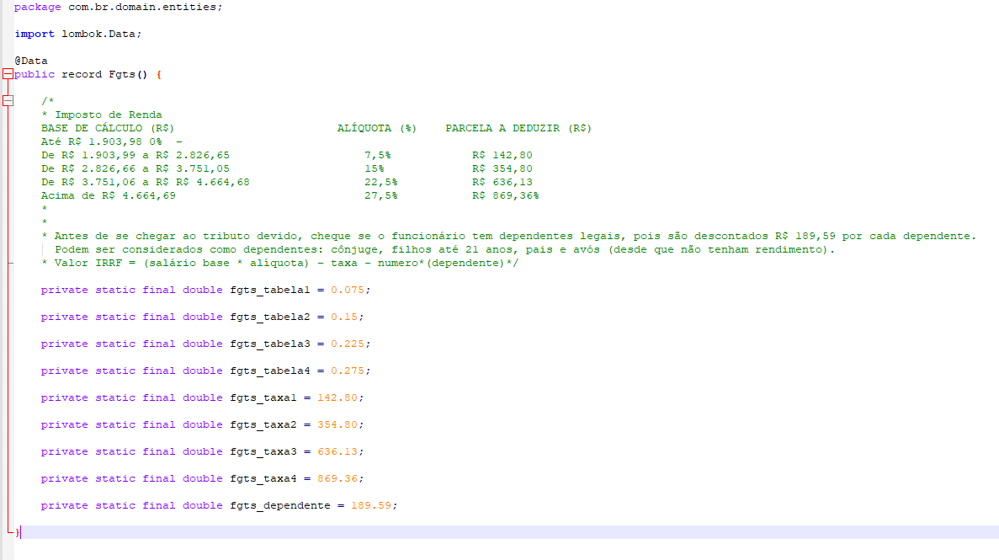

# Gestão escolar
[]: # Title: Gestão escolar
[]: # Author: [Damaris Collopy](

**Objetivo**

Criar um projeto de gestão escolar, onde o usuário poderá cadastrar alunos, professores, turmas, disciplinas, notas, faltas, etc.

**Requisitos**
- [x] Criar um projeto no GitHub
- [ ] Criar um esteira de integração contínua
- [ ] Criar camada de domino
- [ ] Criar TDD
- [ ] Criar uma API REST
- [ ] Criar um banco de dados
- [ ] Criar um autenticação
- [ ] Criar um front-end


**Tecnologias**
- [x] Java
- [ ] Spring Boot
- [ ] Spring Data
- [ ] Spring Security
- [ ] Banco de dados em aberto
- [x] GitActions

**Princípios para projeto de software**
- [x] SOLID
- [x] Clean Code
- [x] Clean Architecture
- [x] DDD
- [x] TDD
- [x] POO


- SOLID
````
S - Single Responsability Principle
O - Open Closed Principle
L - Liskov Substitution Principle
I - Interface Segregation Principle
D - Dependency Inversion Principle
````

- Clean Code
````
- Nomes significativos
- Funções pequenas
- Comentários
- Indentação
- Espaços em branco
- Formatação
- Estrutura de código
- Objetos e estrutura de dados
- Tratamento de erros
- Testes
````
- Clean Architecture
````
- Camadas
- Injeção de dependência
- Testes
- Convenções
- Padrões
````

- DDD
````
- Domínio
- Aplicação
- Infraestrutura
- Testes
````

# Domain-Driven Design (DDD): Um Resumo

````
DDD defende que a separação entre domínio e tecnologia deve ser promovida e expressa na arquitetura do sistema. Para tanto, 
padrões como Arquitetura em Camadas, Arquitetura Limpa (Clean Architecture) ou Arquitetura Hexagonal podem ser usados.

DDD defende que o domínio deve ser modelado em termos de objetos de negócio, e não em termos de objetos de tecnologia.
Em clean architecture, por exemplo, o domínio é modelado em termos de entidades, agregados, serviços, repositórios, etc.
Martin deixa claro a importancia da camada de entidade ela é separada das demais camadas, e não deve depender de nenhuma delas.
O DDD tem essa mesma abordagem, onde o domínio é modelado em termos de objetos de negócio, e não em termos de objetos de tecnologia.
Como diz Tio Bob, existe os detalhes e nele estao a infra, banco de dados e etc. E essa deve ser a ultima camada a ser implementada. 
Deixando assim a arquetetura sempre aberta para mudaças. Já a politica é onde esta a regra de negocio, e ela deve ser a primeira camada
a ser implementada sempre com a utilização TDD.

DDD defende que os desenvolvedores devem ter um profundo conhecimento do domínio do sistema que eles desenvolvem. Esse conhecimento deve
ser obtido por meio de conversas e discussões frequentes com especialistas no domínio (ou no negócio). Portanto, o design do sistema deve 
ser norteado para atender ao seu domínio. E não, por exemplo, para se moldar a uma determinada tecnologia de programação. Em suma, o design
é dirigido pelo domínio, e não por frameworks, arquiteturas, linguagens de programação, etc.

Antes de avançarmos, é importante mencionar também que DDD se sobressai quando é usado em sistemas para domínios complexos, cujas regras 
de negócio são mais difíceis de serem imediatamente entendidas e implementadas pelos desenvolvedores.

Linguagem Ubíqua
Linguagem Ubíqua (ou Linguagem Onipresente) é um conceito central de DDD. Ela consiste de um conjunto de termos que devem ser plenamente 
entendidos tanto por especialistas no domínio (usuários do sistema) como por desenvolvedores (implementadores do sistema).

Para um projeto de software dar certo, DDD defende que esses dois papéis – especialistas no domínio e desenvolvedores – devem falar a mesma 
língua, que vai constituir a chamada Linguagem Ubíqua do sistema. Essa ideia é ilustrada na seguinte figura:


````



````
A figura deixa claro que existem termos que só os especialistas de domínio conhecem. Já outros termos, de cunho tecnológico, são do conhecimento 
apenas dos desenvolvedores. Porém, existe um conjunto de termos que devem ser do conhecimento de ambos, os quais formam a Linguagem Ubíqua do sistema.

Os termos da Linguagem Ubíqua são usados com dois propósitos:

 * Para possibilitar uma comunicação fluida entre desenvolvedores e especialistas no domínio.

 * Para nomear entidades do código do sistema, como classes, métodos, atributos, pacotes, módulos, tabelas de bancos de dados, rotas de APIs, etc.

Além de clarificar o significado dos termos da linguagem ubíqua, é importante que se definam os relacionamentos e associações que existem entre eles.

````

````
Objetos de Domínio
DDD foi proposto pensando em sistemas implementados em linguagens orientadas a objetos. Então, quando se define o design desses sistemas, alguns 
tipos importantes de objetos se destacam. Dentre eles, DDD lista os seguintes:

Entidades
Objetos de Valor
Serviços
Agregados
Repositórios
Esses tipos de objetos de domínio devem ser entendidos como as ferramentas conceituais que um projetista deve lançar mão para projetar com sucesso 
um determinado sistema. Por isso, eles são chamados também dos building blocks de DDD. Iremos comentar sobre cada um deles a seguir.

* Entidades e Objetos de Valor 

Uma entidade é um objeto que possui uma identidade única, que o distingue dos demais objetos da mesma classe.

Por outro lado, objetos de valor (value objects) não possuem um identificador único. Assim, eles são caracterizados apenas por seu estado, 
isto é, pelos valores de seus atributos. 
É interessante mencionar também que, recentemente, algumas linguagens de programação passaram a oferecer suporte sintático para implementação 
de objetos de valor. Por exemplo, nas versões mais novas de Java, eles podem ser implementados por meio de records.
````

 
````
* Serviços

Existem operações importantes do domínio que não se encaixam em entidades e objetos de valor. Assim, o ideal é criar objetos específicos para 
implementar essas operações. No jargão de DDD, esses objetos são chamados de serviços. Em alguns sistemas, é comum ver esses objetos sendo chamados 
também de gerenciadores ou controladores.

A assinatura das operações de um objeto de serviço pode incluir entidades e objetos de valor. No entanto, objetos de serviço não devem possuir estado, 
isto é, eles devem ser stateless. Por isso, eles não costumam ter atributos, mas apenas métodos.

Serviços normalmente são implementados como singletons, ou seja, possuem uma única instância durante a execução do sistema. 
Exemplo - dominio/src/main/java/br/com/gestao_escola/entidade/servico
````

````
Agregados
Agregados (aggregates) são coleções de entidades e objetos de valor. Ou seja, algumas vezes não faz sentido raciocinar sobre entidades e objetos de valor 
de forma individual. Em vez disso, temos que pensar em grupos de objetos para ter uma visão consistente com o domínio que estamos modelando.

Um agregado possui um objeto raiz, que deve ser uma entidade. Externamente, o agregado é acessado a partir dessa raiz. A raiz, por sua vez, referencia os 
objetos internos do agregado. Porém, esses objetos internos não devem ser visíveis para o resto do sistema, ou seja, apenas a raiz pode referenciá-los.

Como formam uma unidade coerente, agregados são persistidos em conjunto em bancos de dados. A deleção de um agregado, da memória principal ou de um banco 
de dados, implica na deleção da sua raiz e de todos os objetos internos.

Como eles são objetos mais complexos e com objetos internos, pode ser interessante implementar métodos especificamente para criação de agregados, os quais 
são chamados de fábricas. Ou seja, tais métodos são implementações do padrão de projeto de mesmo nome.

Aqui no projeto vou utilizar a Abstracty Factory uma tecnica citada por Robert C. Martin no livro Clean Code, ele usa essa bordagem para manter a camada de 
entidade isolada já que com isso faço um inversao de dependencia 
````
````
Repositórios
Para implementar certos serviços do domínio precisamos antes obter referências para determinados objetos.

Por exemplo, suponha um serviço que lista os Empréstimos realizados por um Usuário. Para implementá-lo, não podemos assumir que todos os agregados do tipo 
Empréstimo estão na memória principal. Na verdade, em qualquer sistema real, eles estão armazenados em um banco de dados.

Um repositório é então um objeto usado para recuperar outros objetos de domínio de um banco de dados. Seu objetivo é prover uma abstração que blinde os 
desenvolvedores de preocupações relacionadas com acesso a bancos de dados. Normalmente, repositórios são criados para recuperar entidades ou agregados.

Em outras palavras, um repositório oferece uma abstração para o banco de dados usado pelo sistema e, assim, permite que os desenvolvedores continuem 
focados no domínio, em vez de ter sua atenção desviada, em certos momentos, para uma tecnologia de armazenamento de dados. Em termos mais concretos, 
um repositório permite manipular objetos de domínio como se eles fossem listas (ou coleções) armazenadas na memória principal. A implementação interna 
do repositório cuida então de ler e salvar essas listas no banco de dados.
````
````
Contextos Delimitados
Com o tempo, sistemas de software ficam mais complexos e abrangentes. Por isso, é irrealista imaginar que sistemas de organizações grandes e complexas vão 
possuir um modelo de domínio único e baseado na mesma linguagem ubíqua.

Em vez disso, é natural que tais organizações tenham sistemas que atendem a usuários com perfis e necessidades diferentes, o que complica a definição de 
uma linguagem ubíqua. A solução para esse problema consiste em quebrar tais domínios complexos em domínios menores, os quais em DDD são chamados de Contextos 
Delimitados (Bounded Contexts).
````
````
Camada Anticorrupção
Às vezes, temos que integrar sistemas que estão em contextos delimitados diferentes. Por exemplo, um sistema A precisa usar serviços de um sistema B, que 
pode inclusive ser um sistema externo, isto é, de uma outra organização. Para evitar que A tenha que se adaptar e usar, mesmo que parcialmente, a linguagem 
ubíqua de B, pode-se usar uma Camada Anticorrupção para mediar essa comunicação.

Essa camada é formada por três tipos principais de classes:

Classes de Serviço, cujos métodos serão chamados por A e que, portanto, seguem a linguagem ubíqua desse sistema.

Classes Adaptadoras, que convertem o modelo e os tipos de dados de B para o modelo e tipos de dados de A. Ou seja, essas classes vão isolar elementos próprios 
de B e evitar que eles cheguem até o sistema A.

Uma Classe de Fachada, usada para acessar o sistema B. O papel dessa classe é facilitar o uso de B, principalmente quando ele é um sistema legado com uma interface 
complexa e antiga.

Logo, o fluxo costuma ser o seguinte:

Sistema A -> [ Serviços -> Adaptadores -> Fachada ] -> Sistema B
Nesse fluxo, as classes entre colchetes constituem a Camada Anticorrupção que foi construída para integrar os sistemas A e B.
````

**Fonte**
- [https://engsoftmoderna.info/artigos/ddd.html](https://engsoftmoderna.info/artigos/ddd.html)